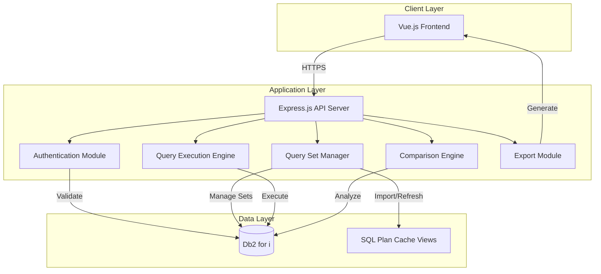
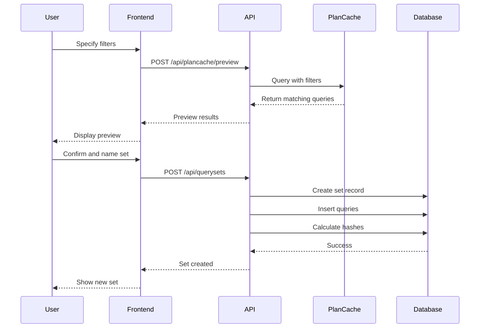
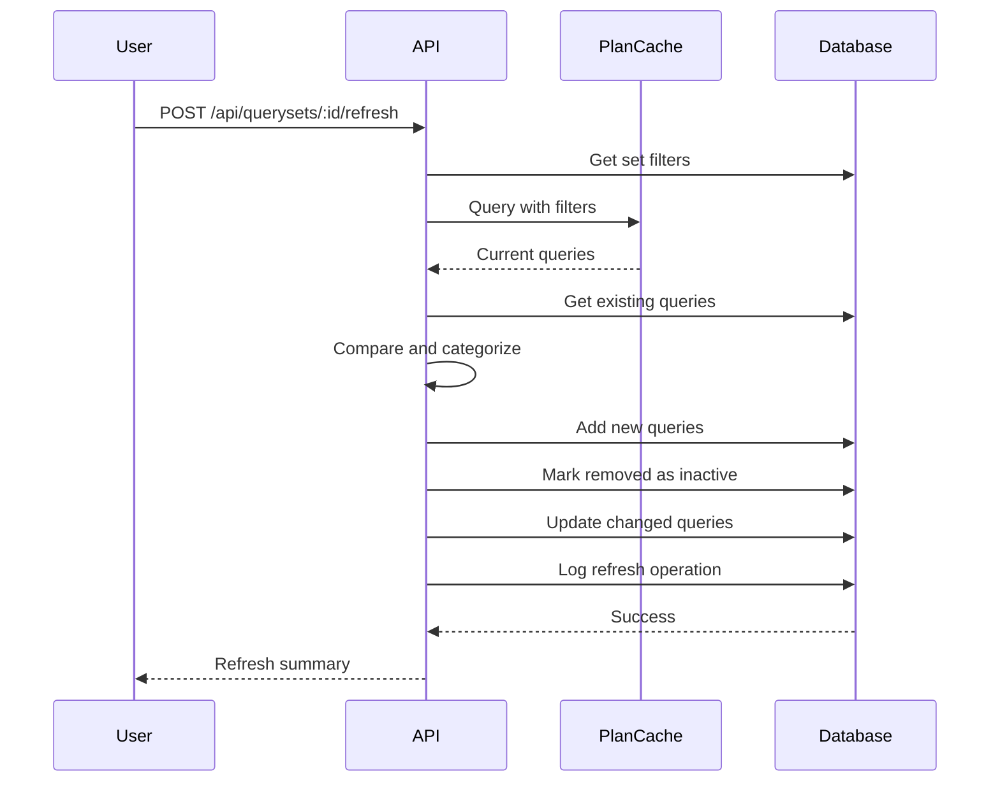
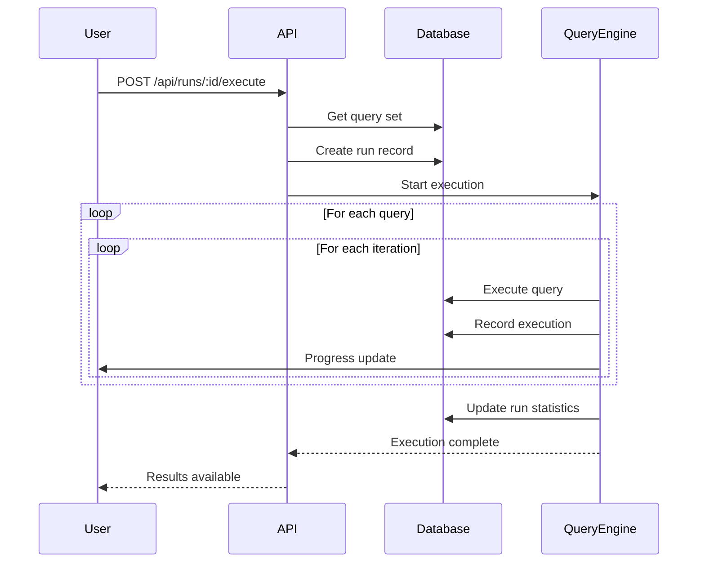
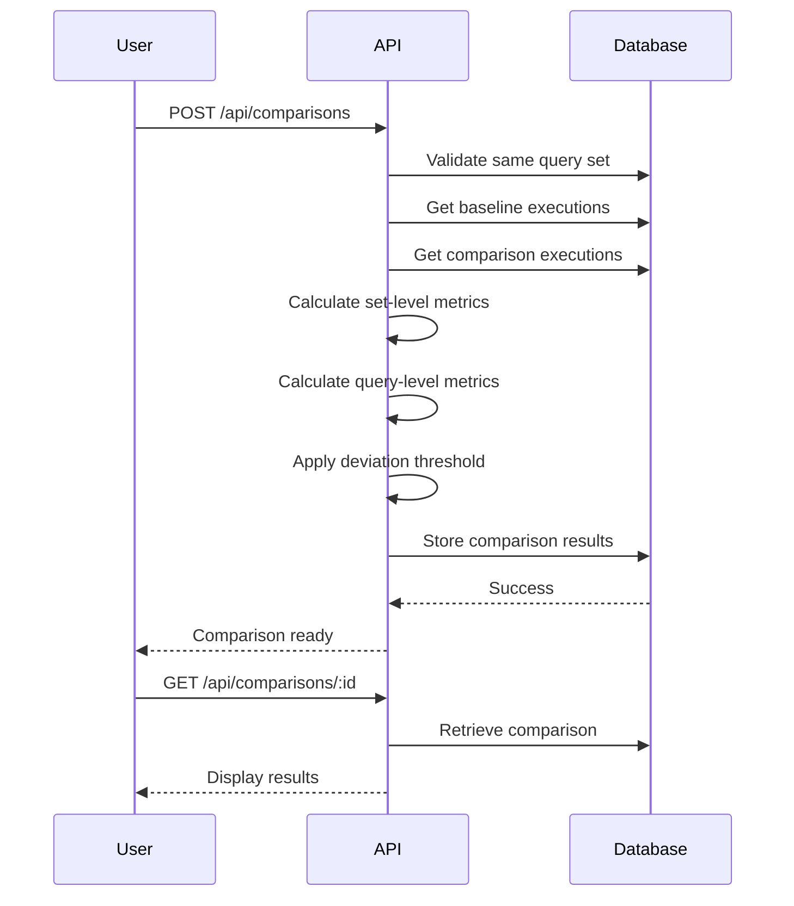

# IBM i Query Runner - System Architecture

## Overview
A full-stack web application for IBM i that imports SQL queries from the plan cache into organized query sets, executes them multiple times, and compares performance metrics before and after system changes (patches, OS upgrades).

## Technology Stack

### Backend
- **Runtime**: Node.js
- **Framework**: Express.js
- **Database**: Db2 for i
- **Database Driver**: node-jt400 (JDBC)
- **Authentication**: IBM i user profiles

### Frontend
- **Framework**: Vue.js 3
- **Styling**: Tailwind CSS
- **Build Tool**: Vite
- **HTTP Client**: Axios

## System Architecture

## Core Concepts

### Query Sets
A **Query Set** is a collection of queries grouped by:
- User profile (who ran the queries)
- Import date/time (when imported from plan cache)
- Optional filters (date range, execution count, etc.)

Query sets can be:
- Created by importing from plan cache
- Refreshed to sync with current plan cache state
- Executed as a unit in test runs
- Tracked individually and collectively

### Test Runs
A **Test Run** executes a query set multiple times and records:
- Individual query execution metrics
- Set-level aggregate statistics
- Timing and performance data

### Comparisons
Compare two test runs to identify performance changes at:
- Query set level (overall performance)
- Individual query level (specific regressions/improvements)

## Database Schema

### Tables

#### QRYRUN_USERS
Stores authorized users for the application.
- `USER_ID` VARCHAR(10) PRIMARY KEY - IBM i user profile
- `USER_NAME` VARCHAR(50) - Full name
- `EMAIL` VARCHAR(100) - Email address
- `IS_ADMIN` CHAR(1) - Admin flag (Y/N)
- `CREATED_AT` TIMESTAMP - Creation timestamp
- `LAST_LOGIN` TIMESTAMP - Last login timestamp

#### QRYRUN_QUERY_SETS
Stores query set definitions and metadata.
- `SET_ID` INT PRIMARY KEY GENERATED ALWAYS AS IDENTITY
- `SET_NAME` VARCHAR(100) - User-friendly name
- `SET_DESCRIPTION` VARCHAR(500) - Optional description
- `SOURCE_USER_PROFILE` VARCHAR(10) - User profile filter for plan cache
- `IMPORT_DATE_FROM` DATE - Start date filter for plan cache
- `IMPORT_DATE_TO` DATE - End date filter for plan cache
- `PLAN_CACHE_VIEW` VARCHAR(50) - Which view used (PLAN_CACHE_INFO or PLAN_CACHE)
- `ADDITIONAL_FILTERS` VARCHAR(1000) - JSON string of other filters
- `CREATED_BY` VARCHAR(10) - User who created set
- `CREATED_AT` TIMESTAMP - Creation timestamp
- `LAST_REFRESHED` TIMESTAMP - Last refresh from plan cache
- `IS_ACTIVE` CHAR(1) - Active flag (Y/N)
- `QUERY_COUNT` INT - Current number of queries in set

#### QRYRUN_QUERIES
Stores individual queries within query sets.
- `QUERY_ID` INT PRIMARY KEY GENERATED ALWAYS AS IDENTITY
- `SET_ID` INT - Foreign key to QRYRUN_QUERY_SETS
- `QUERY_TEXT` CLOB - SQL query text
- `QUERY_NAME` VARCHAR(100) - User-friendly name (optional)
- `QUERY_HASH` VARCHAR(64) - Hash for duplicate detection
- `SOURCE_USER` VARCHAR(10) - Original user who ran query
- `PLAN_CACHE_KEY` VARCHAR(100) - Key from plan cache for refresh tracking
- `ADDED_AT` TIMESTAMP - When added to set
- `LAST_SEEN_IN_CACHE` TIMESTAMP - Last time found during refresh
- `IS_ACTIVE` CHAR(1) - Active flag (Y/N)
- `SEQUENCE_NUM` INT - Order within set

#### QRYRUN_SET_REFRESH_LOG
Tracks refresh operations on query sets.
- `REFRESH_ID` INT PRIMARY KEY GENERATED ALWAYS AS IDENTITY
- `SET_ID` INT - Foreign key to QRYRUN_QUERY_SETS
- `REFRESHED_BY` VARCHAR(10) - User who initiated refresh
- `REFRESHED_AT` TIMESTAMP - Refresh timestamp
- `QUERIES_ADDED` INT - Number of queries added
- `QUERIES_REMOVED` INT - Number of queries removed
- `QUERIES_UPDATED` INT - Number of queries updated
- `QUERIES_UNCHANGED` INT - Number of queries unchanged
- `REFRESH_STATUS` VARCHAR(20) - 'SUCCESS', 'PARTIAL', 'FAILED'
- `ERROR_MESSAGE` VARCHAR(1000) - Error details if failed

#### QRYRUN_TEST_RUNS
Stores test run configurations and metadata.
- `RUN_ID` INT PRIMARY KEY GENERATED ALWAYS AS IDENTITY
- `SET_ID` INT - Foreign key to QRYRUN_QUERY_SETS
- `RUN_NAME` VARCHAR(100) - User-provided label
- `RUN_DESCRIPTION` VARCHAR(500) - Optional description
- `ITERATION_COUNT` INT - Number of times to execute each query
- `METRICS_LEVEL` VARCHAR(20) - 'BASIC', 'STANDARD', 'COMPREHENSIVE'
- `CREATED_BY` VARCHAR(10) - User who created run
- `CREATED_AT` TIMESTAMP - Creation timestamp
- `STARTED_AT` TIMESTAMP - Execution start time
- `COMPLETED_AT` TIMESTAMP - Execution completion time
- `STATUS` VARCHAR(20) - 'PENDING', 'RUNNING', 'COMPLETED', 'FAILED'
- `TOTAL_QUERIES` INT - Total queries in set
- `SUCCESSFUL_QUERIES` INT - Successfully executed queries
- `FAILED_QUERIES` INT - Failed queries
- `TOTAL_EXECUTIONS` INT - Total individual executions
- `AVG_DURATION_MS` DECIMAL(15,3) - Average duration across all executions

#### QRYRUN_EXECUTIONS
Stores individual query execution results.
- `EXECUTION_ID` BIGINT PRIMARY KEY GENERATED ALWAYS AS IDENTITY
- `RUN_ID` INT - Foreign key to QRYRUN_TEST_RUNS
- `QUERY_ID` INT - Foreign key to QRYRUN_QUERIES
- `ITERATION_NUM` INT - Iteration number (1 to N)
- `START_TIME` TIMESTAMP(6) - Execution start (microsecond precision)
- `END_TIME` TIMESTAMP(6) - Execution end (microsecond precision)
- `DURATION_MS` DECIMAL(15,3) - Duration in milliseconds
- `STATUS` VARCHAR(20) - 'SUCCESS', 'FAILED', 'TIMEOUT'
- `ERROR_MESSAGE` VARCHAR(1000) - Error details if failed
- `ROWS_RETURNED` BIGINT - Number of rows returned
- `ROWS_AFFECTED` BIGINT - Number of rows affected

#### QRYRUN_METRICS
Stores detailed performance metrics (when comprehensive mode enabled).
- `METRIC_ID` BIGINT PRIMARY KEY GENERATED ALWAYS AS IDENTITY
- `EXECUTION_ID` BIGINT - Foreign key to QRYRUN_EXECUTIONS
- `CPU_TIME_MS` DECIMAL(15,3) - CPU time in milliseconds
- `IO_OPERATIONS` BIGINT - Number of I/O operations
- `LOGICAL_READS` BIGINT - Logical reads
- `PHYSICAL_READS` BIGINT - Physical reads
- `TEMP_STORAGE_KB` BIGINT - Temporary storage used
- `ESTIMATED_COST` DECIMAL(15,2) - Query optimizer cost
- `ACTUAL_ROWS` BIGINT - Actual rows processed

#### QRYRUN_COMPARISONS
Stores comparison analysis results.
- `COMPARISON_ID` INT PRIMARY KEY GENERATED ALWAYS AS IDENTITY
- `BASELINE_RUN_ID` INT - Foreign key to baseline test run
- `COMPARISON_RUN_ID` INT - Foreign key to comparison test run
- `CREATED_BY` VARCHAR(10) - User who created comparison
- `CREATED_AT` TIMESTAMP - Creation timestamp
- `DEVIATION_THRESHOLD` DECIMAL(5,2) - Threshold percentage
- `SET_LEVEL_CHANGE` DECIMAL(8,2) - Overall set performance change %
- `QUERIES_ANALYZED` INT - Total queries compared
- `QUERIES_IMPROVED` INT - Queries that got faster
- `QUERIES_DEGRADED` INT - Queries that got slower
- `QUERIES_UNCHANGED` INT - Queries with no significant change
- `QUERIES_FAILED_BASELINE` INT - Queries that failed in baseline
- `QUERIES_FAILED_COMPARISON` INT - Queries that failed in comparison

#### QRYRUN_COMPARISON_DETAILS
Stores per-query comparison details.
- `DETAIL_ID` BIGINT PRIMARY KEY GENERATED ALWAYS AS IDENTITY
- `COMPARISON_ID` INT - Foreign key to QRYRUN_COMPARISONS
- `QUERY_ID` INT - Foreign key to QRYRUN_QUERIES
- `BASELINE_AVG_MS` DECIMAL(15,3) - Baseline average duration
- `COMPARISON_AVG_MS` DECIMAL(15,3) - Comparison average duration
- `BASELINE_MIN_MS` DECIMAL(15,3) - Baseline minimum duration
- `COMPARISON_MIN_MS` DECIMAL(15,3) - Comparison minimum duration
- `BASELINE_MAX_MS` DECIMAL(15,3) - Baseline maximum duration
- `COMPARISON_MAX_MS` DECIMAL(15,3) - Comparison maximum duration
- `PERCENT_CHANGE` DECIMAL(8,2) - Percentage change
- `STATUS` VARCHAR(20) - 'IMPROVED', 'DEGRADED', 'UNCHANGED', 'FAILED'
- `BASELINE_FAILURES` INT - Number of failures in baseline
- `COMPARISON_FAILURES` INT - Number of failures in comparison

## API Endpoints

### Authentication
- `POST /api/auth/login` - Authenticate user with IBM i credentials
- `POST /api/auth/logout` - Logout current user
- `GET /api/auth/session` - Get current session info

### Users
- `GET /api/users` - List authorized users (admin only)
- `POST /api/users` - Add new user (admin only)
- `DELETE /api/users/:userId` - Remove user (admin only)

### Query Sets
- `GET /api/querysets` - List all query sets
- `GET /api/querysets/:id` - Get query set details
- `POST /api/querysets` - Create new query set from plan cache
- `PUT /api/querysets/:id` - Update query set metadata
- `DELETE /api/querysets/:id` - Delete query set
- `POST /api/querysets/:id/refresh` - Refresh query set from plan cache
- `GET /api/querysets/:id/queries` - List queries in set
- `GET /api/querysets/:id/refresh-history` - Get refresh log

### Plan Cache
- `GET /api/plancache/views` - List available plan cache views
- `POST /api/plancache/preview` - Preview queries matching filters (before creating set)

### Queries
- `GET /api/queries/:id` - Get specific query details
- `PUT /api/queries/:id` - Update query (name, active status)
- `DELETE /api/queries/:id` - Remove query from set
- `POST /api/queries` - Add manual query to set
- `POST /api/queries/validate` - Validate SQL syntax

### Test Runs
- `GET /api/runs` - List all test runs
- `GET /api/runs/:id` - Get test run details
- `POST /api/runs` - Create new test run for a query set
- `POST /api/runs/:id/execute` - Start test run execution
- `GET /api/runs/:id/status` - Get real-time execution status
- `GET /api/runs/:id/results` - Get execution results (set and query level)
- `GET /api/runs/:id/results/query/:queryId` - Get specific query results

### Comparisons
- `GET /api/comparisons` - List all comparisons
- `POST /api/comparisons` - Create new comparison
- `GET /api/comparisons/:id` - Get comparison details (set and query level)
- `GET /api/comparisons/:id/export` - Export comparison as HTML

### Configuration
- `GET /api/config` - Get application configuration
- `PUT /api/config` - Update configuration (admin only)

## Key Features

### 1. Query Set Management

#### Creating a Query Set
1. User specifies filters:
   - User profile (required)
   - Date range (optional)
   - Plan cache view (PLAN_CACHE_INFO or PLAN_CACHE)
   - Additional filters (execution count, etc.)
2. System previews matching queries
3. User provides set name and description
4. System creates set and imports queries
5. Each query assigned a sequence number and hash

#### Refreshing a Query Set
1. User initiates refresh on existing set
2. System queries plan cache using original filters
3. System compares current cache with set contents:
   - **Add**: New queries found in cache
   - **Remove**: Queries no longer in cache (mark inactive)
   - **Update**: Queries with changed text (create new version)
   - **Unchanged**: Queries still matching
4. Log refresh operation with statistics
5. Update set's last_refreshed timestamp

### 2. Query Execution Engine
- Execute entire query set as a unit
- Support for multiple iterations per query
- High-precision timing (microsecond level)
- Continue on error with detailed logging
- Real-time progress updates via WebSocket
- Track both set-level and query-level metrics

### 3. Metrics Collection
Three levels of detail:
- **Basic**: Start time, end time, duration, success/failure
- **Standard**: Basic + rows returned/affected, error messages
- **Comprehensive**: Standard + CPU time, I/O stats, optimizer cost

### 4. Results Viewing
Two levels of granularity:
- **Set Level**: Aggregate statistics, overall performance, success rate
- **Query Level**: Individual query performance, iteration details, error logs

### 5. Comparison Analysis
- Compare any two test runs (must be from same query set)
- Calculate set-level performance change
- Identify queries with significant deviations
- Configurable threshold (default 20%)
- Statistical summary (improved/degraded/unchanged)
- Track new failures or resolved failures

### 6. HTML Report Export
- Professional formatted report
- Set-level summary statistics
- Detailed query-by-query comparison
- Charts and visualizations
- Print-friendly layout

### 7. Security
- IBM i user profile authentication
- Access control list in database
- QSECOFR always granted access
- Session management with JWT tokens
- Role-based permissions (admin/user)

## Data Flow

### Query Set Creation Flow

### Query Set Refresh Flow

### Test Run Execution Flow

### Comparison Flow

## UI Workflow

### Main Navigation
1. **Dashboard** - Overview of query sets and recent runs
2. **Query Sets** - Manage query sets
3. **Test Runs** - View and execute test runs
4. **Comparisons** - Compare test runs
5. **Users** - User management (admin only)
6. **Settings** - Application configuration

### Query Set Management Screen
- List all query sets with metadata
- Create new set button
- For each set:
  - View queries in set
  - Refresh from plan cache
  - Create test run
  - Edit/Delete set
  - View refresh history

### Test Run Screen
- List all test runs grouped by query set
- Create new run button
- For each run:
  - View set-level results
  - Drill down to query-level results
  - Compare with other runs
  - Export report

### Comparison Screen
- Select two runs to compare (from same set)
- Set deviation threshold
- View set-level comparison
- View query-level details
- Export HTML report

## Performance Considerations

1. **Query Execution**: Use connection pooling for parallel execution
2. **Large Result Sets**: Stream results instead of loading into memory
3. **Metrics Collection**: Batch insert execution records
4. **Real-time Updates**: Use WebSocket for progress updates
5. **Report Generation**: Generate HTML server-side to reduce client load
6. **Query Set Refresh**: Process in background for large sets

## Security Considerations

1. **Authentication**: Validate IBM i credentials via JDBC connection
2. **Authorization**: Check user access in QRYRUN_USERS before operations
3. **SQL Injection**: Use parameterized queries for all database operations
4. **Session Management**: JWT tokens with expiration
5. **Audit Trail**: Log all user actions with timestamps

## Future Enhancements (Out of Scope for Initial Release)

1. Scheduled test runs
2. Email notifications on completion
3. Query performance trending over time
4. Query optimization suggestions
5. Multi-system comparison
6. REST API for integration with other tools
7. Query set templates
8. Automated refresh scheduling